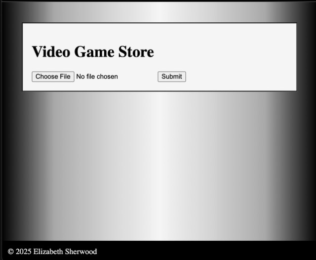

# Project Title
- Lab: Video Game Store
- Name: Elizabeth Sherwood
- Due: Tuesday, 10/07/2025

## Description
- Upload, Save, and Display CSV

## Requirements
- PHP installed (version 8)
- Local server (XAMPP, MAMP etc,)
- Web browser

## Installation
1. Clone or download the repository.
2. Place the project folder into your server’s web root (e.g., `htdocs/` for XAMPP).
3. Start the server.

## Repo
[ShErWooD-ForEsd](https://github.com/ShErWooD-ForEsd/Video-Game-Store-Lab.git)

## Screenshot of homepage
